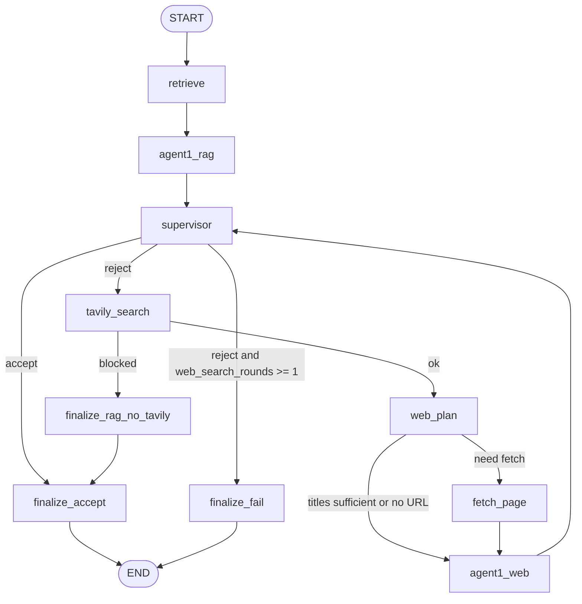

# F1 Assistant — подробная документация

Архитектура, RAG, метрики поиска, LangGraph, промпты GigaChat, HTTP API. Установка и переменные окружения — в [README.md](README.md).

---

## 1. Назначение и поток обработки вопроса

1. **RAG** — векторный поиск по чанкам в **Chroma** (тексты собраны из CSV f1db, русский язык).
2. **GigaChat** — ответ строго по найденным фрагментам (JSON: `message` + `sections`).
3. **Супервизор (GigaChat)** — принять или отклонить черновик; числовой score ретривала не участвует.
4. При отклонении и доступном **Tavily** — не более **одного** поискового запроса за ход, опционально **одна** догрузка HTML, веб-синтез, снова супервизор.

**Оркестрация — LangGraph** (`src/graph/f1_turn_graph.py`): `StateGraph(F1TurnState)`, узлы и условные переходы, `compile()`, `invoke(..., config={"recursion_limit": 25})`.

**LangChain в проекте:** только **langchain-community** — инструмент `TavilySearchResults` и обёртка API в `src/graph/tavily_tool.py` (плюс кастомный таймаут HTTP). Пакет **langchain-core** подтягивается зависимостью **LangGraph**; в `src/` прямых импортов `langchain_core` нет. Цепочки LCEL (`prompt | model`) **не используются**; GigaChat вызывается через SDK **gigachat**.

**Не подключено к этому пайплайну:** модули `src/live/` (эвристика `requires_live_data`), вспомогательные функции `live_*` / `build_live_*` в `russian_qna.py`, поля контрактов с отсылкой к внешнему API — в коде есть как заготовки, **граф одного хода чата их не вызывает**.



Узлы: `retrieve` → `agent1_rag` → `supervisor`; при отказе — `tavily_search` → при ошибке ключа/сети `finalize_rag_no_tavily` (повторный RAG), иначе `web_plan` → при необходимости `fetch_page` → `agent1_web` → снова `supervisor`. Итог: `finalize_accept` или `finalize_fail`.

Значения `details.synthesis.route` (типично): `gigachat_rag`, `gigachat_web`, `template_fallback`, `gigachat_rag_no_web`, `supervisor_gave_up`.

`gigachat_judge_rag_sufficient` в граф **не входит** (остаётся для тестов/альтернативных сборок).

---

## 2. Карта кода

### 2.1. Входы и API

| Путь | Назначение |
|------|------------|
| `api.py` | Uvicorn с `reload` по `src/`, исключая `.venv`, `.chroma`, `.git`. |
| `src/main.py` | FastAPI, `load_dotenv`, роутер чата, сессии, авторизация. |
| `streamlit_app.py` | UI: HTTP к API, provenance. |

**Uvicorn вручную:**

```bash
uvicorn src.main:app --host 127.0.0.1 --port 8000 --reload \
  --reload-dir src \
  --reload-exclude .venv --reload-exclude .chroma --reload-exclude .git
```

| Путь | Назначение |
|------|------------|
| `src/api/chat.py` | `POST /start_chat`, `GET /message_status`, `POST /next_message`; `run_f1_turn_sync`. |
| `src/models/api_contracts.py` | Pydantic: ответы, `EvidenceItem`, provenance. |
| `src/sessions/store.py` | Сессии в памяти, TTL. |
| `src/auth/*`, `src/models/auth.py` | Код доступа, лимиты, `X-Session-Id`. |

### 2.2. Граф и веб

| Путь | Назначение |
|------|------------|
| `src/graph/f1_turn_graph.py` | LangGraph, состояние хода, узлы и рёбра. |
| `src/graph/tavily_tool.py` | Tavily через LangChain Community, таймаут `TAVILY_TIMEOUT`. |
| `src/graph/page_fetch.py` | Загрузка страницы (httpx), текст из HTML. |

### 2.3. LLM

| Путь | Назначение |
|------|------------|
| `src/answer/gigachat_rag.py` | GigaChat: RAG, веб, Tavily-query, супервизор, план URL; системные промпты — раздел 7. |
| `src/answer/russian_qna.py` | Уверенность по `rank_score`, источники, шаблон при падении GigaChat; функции `live_*` — не используются графом. |

### 2.4. Корпус и запись в Chroma (без поиска)

| Путь | Назначение |
|------|------------|
| `src/retrieval/season_summary_corpus.py` | Чтение CSV f1db, генерация текста чанков (обзор сезона, гонка + классификация). |
| `src/retrieval/index_builder.py` | `PersistentClient(".chroma")`, коллекция `f1_historical`, `upsert` батчами 250. |

### 2.5. Эмбеддинги (модель → вектор)

| Путь | Назначение |
|------|------------|
| `src/retrieval/embeddings.py` | `SentenceTransformerEmbeddingFunction`; модель для индексации задаётся здесь (см. раздел 4). |

### 2.6. Поиск по индексу и подготовка evidence

| Путь | Назначение |
|------|------------|
| `src/retrieval/retriever.py` | `collection.query`, метаданные `where`, преобразование `distance` → `score`, порог `min_score`. |
| `src/retrieval/query_normalize.py` | Нормализация строки; **извлечение года** (regex 1950–2035) для фильтра Chroma; `canonical_entity_ids` / сущности не заполняются. |
| `src/retrieval/evidence.py` | Hit → `EvidenceItem` (snippet для UI, полный текст для LLM). |
| `src/retrieval/rag_limits.py` | `max_chars_per_rag_chunk` / env — не связан с основным усечением в GigaChat (лимиты в `retriever.py` и `gigachat_rag.py`). |
| `src/retrieval/document_schema.py` | Альтернативная схема нарратива; **текущий** `build_historical_index` из неё чанки не строит. |

### 2.7. UI и сообщения

| Путь | Назначение |
|------|------------|
| `src/ui/f1_chat_http.py`, `src/ui/provenance_display.py` | Клиент API, markdown provenance в Streamlit. |
| `src/search/messages_ru.py` | Тексты ошибок (`WEB_SEARCH_UNAVAILABLE` и др.). |

---

## 3. Корпус

Данные: ограниченный набор CSV f1db (список в комментарии в `index_builder.py`). Окно по умолчанию: **50 сезонов** от максимального года в `f1db-races.csv`.

Два вида чанков из `season_summary_corpus.py`: **`season_overview`** (итог сезона и таблица) и **`grand_prix_race`** (итог гонки, метаданные этапа, полная классификация).

Идентификаторы: **`source_id`** (человекочитаемый ключ), **`chunk_id`** — SHA-1 от `dataset=f1db|source_id=...`. В Chroma в метаданных: `dataset`, `table`, `source_id`, `year`, `chunk_kind`, для гонок — `grand_prix_id`.

---

## 4. Эмбеддинги и индекс

- Хранилище: **Chroma** `PersistentClient(path=".chroma")`, коллекция **`f1_historical`**.
- Векторизация: **`chromadb.utils.embedding_functions.SentenceTransformerEmbeddingFunction`** (библиотека **sentence-transformers**).

**Модель:** в проекте используется **`ai-forever/ru-en-RoSBERTa`**. В `embeddings.py` логика выбора имени модели: при непустом **`F1_EMBEDDING_MODEL`** или при наличии валидного каталога **`embedding_model/`** в корне репозитория может подставляться другой путь/идентификатор; **иначе** берётся указанный идентификатор Hugging Face **`ai-forever/ru-en-RoSBERTa`**.

При **создании** коллекции передаётся `embedding_function`; при **открытии** существующей в `retriever` — `embedding_function=None`, чтобы Chroma использовал сохранённую конфигурацию эмбеддингов. Смена модели без пересборки индекса недопустима: векторы станут несовместимы.

---

## 5. Поиск (RAG): алгоритм и метрики

Только **семантический** векторный поиск: `collection.query(query_texts=[...], n_results=top_k, where=...)`. BM25 и полнотекстовый индекс **нет**.

**Параметры в графе:** `top_k=10`, `min_score=0.25` (`retrieve_historical_context` в `f1_turn_graph.py`).

**Метрика в Chroma** для `SentenceTransformerEmbeddingFunction`: пространство по умолчанию **`cosine`**. В коде Chroma косинусная **distance** (как в hnswlib):

\[
\text{distance} = 1 - \frac{x \cdot y}{\|x\|\,\|y\| + \varepsilon}
\]

**В ретривере** (`retriever.py`): `score = max(0.0, 1.0 - distance)` — численно это **косинусное сходство** запроса и документа (с защитой от отрицательных значений из-за погрешностей). Документы с `score < min_score` отбрасываются; оставшиеся сортируются по **убыванию** `score`.

**Фильтр по году:** если `extract_year_int_from_query` извлёк год, в `where` добавляется `$and` с `year == "<год>"` и `dataset == "f1db"`. Если при фильтре результатов нет — повторный запрос **без** фильтра по году.

**Объёмы текста:** полный текст чанка в hit до **16_000** символов (`MAX_LLM_CHARS_PER_HIT`); snippet в API **280**; в блок контекста для RAG до **14_000** символов на фрагмент (`_evidence_block_for_llm` в `gigachat_rag.py`). На результат веб-поиска в синтезе до **1200** символов выдержки; догруженная страница до **12_000** символов в state.

`canonical_entity_ids` в API остаются пустыми.

---

## 6. GigaChat: роли, форматы ответа, системные промпты

Вызовы через `GigaChat(**_client_kwargs())`; модель по умолчанию из **`GIGACHAT_MODEL`** или `GigaChat`. Для JSON-ответов: `_chat_completion_json` (при ошибке парсинга — один repair-раунд в том же чате). Одна строка: `_chat_completion_plain_line` (запрос для Tavily).

Константы в **`gigachat_rag.py`** (системный текст → назначение):

| Константа | Назначение |
|-----------|------------|
| `_SYSTEM_HISTORICAL` | RAG: только контекст `[1]..[n]`, антигаллюцинации, формат JSON `message` + `sections`, требования к прямому ответу и честному отказу. |
| `_SYSTEM_WEB` | Ответ только по выдержкам веб-поиска с URL, тот же JSON. |
| `_SYSTEM_TAVILY_QUERY` | Сформулировать одну поисковую строку для Tavily, без JSON. |
| `_SYSTEM_SUPERVISOR_ACCEPT` | Оценить, отвечает ли черновик на вопрос; JSON `{"accept": true/false}`. |
| `_SYSTEM_WEB_PLAN` | Выбрать один `best_url`, флаг `titles_sufficient`; JSON с опциональным `reason`. |
| `_SYSTEM_JUDGE` | Оценка достаточности контекста для вопроса; JSON `sufficient` — **используется только** в `gigachat_judge_rag_sufficient`, не в текущем графе. |

---

## 7. Tavily

`TavilySearchResults` с `search_depth="basic"`, `TAVILY_MAX_RESULTS` (по умолчанию 5), HTTP timeout через `_TavilySearchAPIWrapperWithTimeout` и `TAVILY_TIMEOUT`. Без `TAVILY_API_KEY` — `tavily_blocked`, ветка `finalize_rag_no_tavily` или сообщение о недоступности веб-поиска (см. `run_f1_turn_sync` и тесты).

---

## 8. HTTP API

- **`POST /start_chat`** — код доступа, опционально первый вопрос; `session_id`.
- **`GET /message_status`**, **`POST /next_message`** — заголовок **`X-Session-Id`**.
- Успех: `status: "ready"`, `message`, `details` (`normalized_query`, `evidence`, `structured_answer`, `synthesis`, при вебе — `web`, `provenance`).

`EvidenceItem.context_for_llm` в JSON ответа не сериализуется (`exclude=True`).

---

## 9. Зависимости

Версии — в [`requirements.txt`](requirements.txt).

| Пакет | Роль |
|-------|------|
| **fastapi**, **uvicorn** | HTTP API |
| **pydantic** | Схемы ответов |
| **httpx** | Запросы (в т.ч. fetch страницы) |
| **python-dotenv** | `.env` |
| **chromadb** | Векторный индекс |
| **sentence-transformers** | Эмбеддинги (RoSBERTa через Chroma) |
| **gigachat** | SDK GigaChat |
| **langgraph** | Граф состояний |
| **langchain-core** | Зависимость LangGraph |
| **langchain-community** | Tavily |
| **streamlit** | UI |
| **pytest** | Тесты |

Отдельный пакет **`langchain`** (полный) для LCEL-агентов не подключается.

---

## 10. Краткий README

Команды установки, индексация, запуск — в [README.md](README.md).
